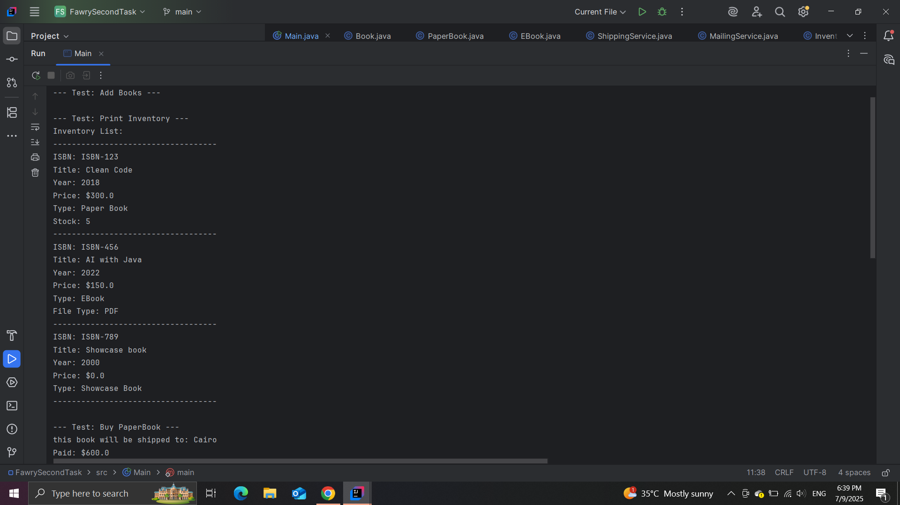
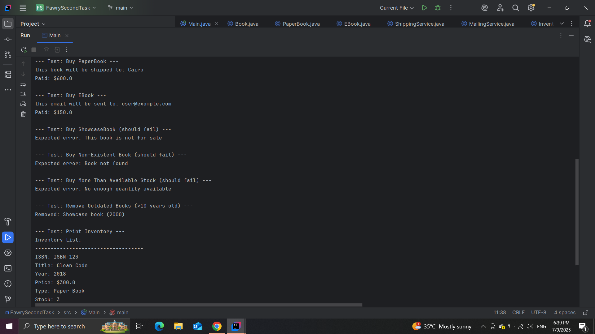
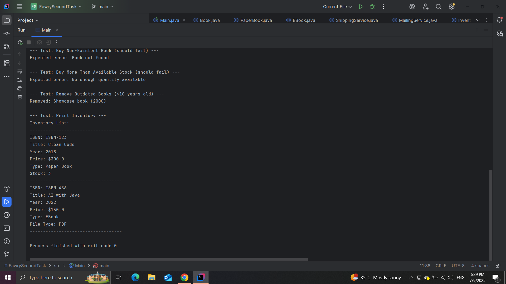

# Quantum Bookstore 🧠📚

An object-oriented Java project that simulates an online bookstore called **Quantum Bookstore**. The system is designed to support multiple types of books and operations such as buying, shipping, emailing, and inventory management — while remaining easily extensible for future types of products.

## 🖼️ Demo Screenshots

Here are screenshots of the Bookstore task running in the terminal:

### 🧪 Application Run Output





---

## 🚀 Features

- 📦 Supports multiple types of books:
  - `PaperBook` – shipped physically with stock control
  - `EBook` – delivered digitally via email
  - `ShowcaseBook` – not for sale (showcase only)

- 🛒 Bookstore operations:
  - Add books to inventory
  - Print inventory with detailed info
  - Buy books by ISBN (with quantity, email, and shipping address)
  - Remove outdated books based on publish year

- 📤 External service stubs:
  - `ShippingService` – simulates shipping
  - `MailingService` – simulates email delivery

---

## 🧩 Extensibility

The system is designed using **interfaces** and **polymorphism**, following the **Open/Closed Principle**. Adding a new book type (e.g., RentalBook, Audiobook) requires:
- Creating a new class that extends `Book`
- Optionally implementing interfaces like `Sellable`, `Shippable`, or `Emailable`

No changes are needed in the existing core logic.

---

## 🏗️ Project Structure
```
QuantumBookstore/
├── src/
│ ├── books/ # Book types and base Book class
│ ├── core/ # Inventory management
│ ├── interfaces/ # Behavior contracts (Sellable, Shippable, etc.)
│ ├── services/ # Simulated external services (mail/shipping)
│ └── test/ # Test cases
├── README.md
```
